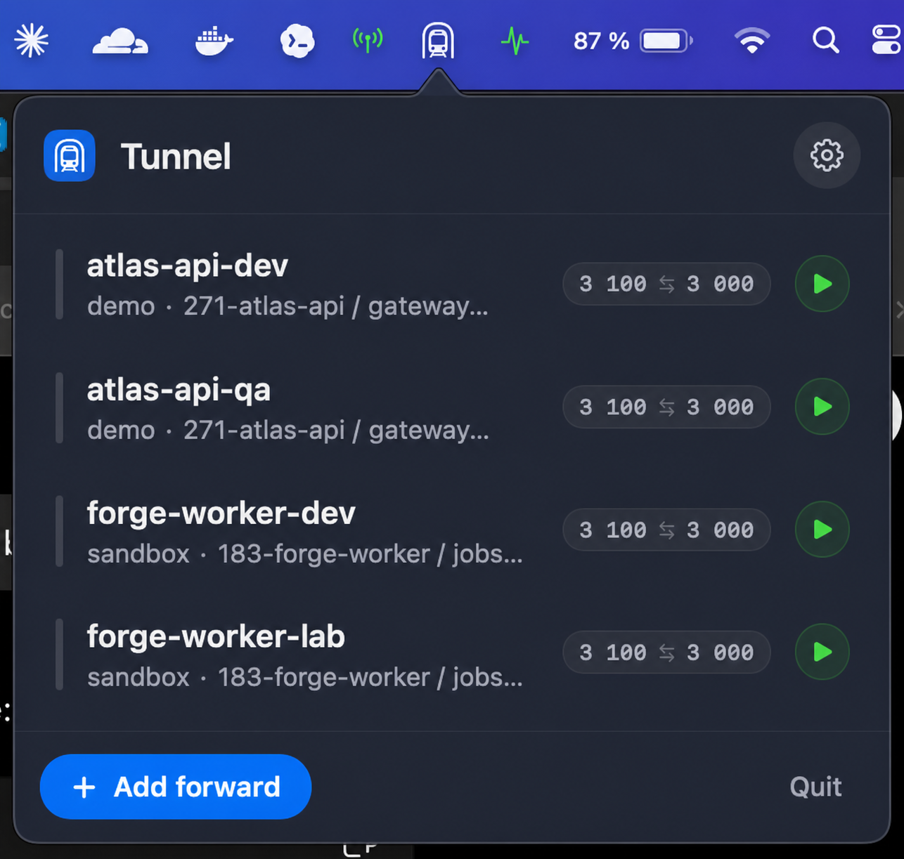

# Tunnel

Tunnel is a native macOS menu bar app for managing `kubectl port-forward`
sessions across Kubernetes contexts. It replaces repeated manual port-forward
commands with a searchable UI, saved forwards, live status, and one-click start
controls.



Use it when local development depends on several cluster services: APIs,
workers, dashboards, internal tools, or anything else that normally requires a
terminal full of long-running `kubectl port-forward` commands.

## Why It Is Useful

- Start common forwards from the menu bar without remembering namespaces,
  contexts, service names, or port pairs.
- Keep a saved list of forwards per machine and restart them when needed.
- Use the menu bar icon as a compact status indicator; its color changes with
  the forwarding state so broken or running sessions are visible at a glance.
- Search services across Kubernetes contexts instead of hand-building commands.
- Detect local port conflicts before starting a session.
- Auto-restart interrupted forwards with backoff.
- Optionally import compatible port-forward aliases from `~/.zshrc`.

## What Tunnel Does

- Targets `services/<name>` so Kubernetes selects a healthy pod behind the
  service.
- Tracks each forward through idle, connecting, running, reconnecting, and failed
  states.
- Spawns `kubectl` with a predictable `PATH` so Homebrew tools and OIDC plugins
  can be found.
- Reads Kubernetes configuration through `kubectl`; it does not modify
  `~/.kube/config`.
- Persists saved forwards as JSON in Application Support.

## Requirements

- macOS 14 or later
- Xcode 16 or later
- [XcodeGen](https://github.com/yonaskolb/XcodeGen)
- `kubectl` on `PATH`, commonly `/opt/homebrew/bin/kubectl` or
  `/usr/local/bin/kubectl`
- For OIDC clusters, `kubelogin` / `oidc-login` available on the app's execution
  path

## Build And Run

Generate the Xcode project:

```bash
brew install xcodegen
xcodegen generate
```

Open the project:

```bash
open Tunnel.xcodeproj
```

In Xcode, select the `Tunnel` scheme, choose `My Mac`, and run. Tunnel is an
`LSUIElement` menu bar app, so it appears in the macOS menu bar instead of the
Dock.

Build from the command line:

```bash
xcodebuild -project Tunnel.xcodeproj -scheme Tunnel -configuration Debug build
```

Run tests:

```bash
xcodebuild -project Tunnel.xcodeproj -scheme Tunnel -destination 'platform=macOS' test
```

## Workflow

1. Open Tunnel from the menu bar.
2. Add a forward by selecting a Kubernetes context, namespace, service, and
   local-to-remote port pair.
3. Start or stop forwards from the popover.
4. Enable auto-start for forwards that should come back when the app launches.
5. Optionally use the `~/.zshrc` importer for compatible existing aliases.

Imported shell entries are read-only. Tunnel does not rewrite your shell config.

## How It Works

```text
MenuBarView
    |
    v
AppState
    |
    +--> ConfigStore
    +--> ServiceCatalog
    +--> PortForwardManager
              |
              v
         KubectlClient
```

`KubectlClient` spawns `kubectl port-forward` as a long-running process and
parses stderr for state changes such as "Forwarding from 127.0.0.1..." or
disconnect messages. `PortForwardManager` owns session lifecycle and reconnect
behavior.

## Project Structure

- `Tunnel/App/` app entry point and status item setup
- `Tunnel/Models/` Kubernetes and port-forward data types
- `Tunnel/Services/` kubectl integration, service catalog, importer, and session
  management
- `Tunnel/State/` app state and persistent config store
- `Tunnel/Views/` SwiftUI menu bar UI
- `TunnelTests/` unit tests
- `Docs/` README screenshots
- `SPEC.md` design notes
- `project.yml` XcodeGen project definition

## Local Data

Saved forwards live at:

```text
~/Library/Application Support/Tunnel/forwards.json
```

The file is JSON, version-stamped, and written atomically.

## Known Limitations

- Service forwards only; raw pod and selector forwards are outside v1.
- Local ports must be 1024 or higher.
- Configuration is per machine; there is no iCloud sync.
- The app is intended to be run from Xcode or a locally built app bundle during
  development.

## Regenerating The Project

`project.yml` is the source of truth for the Xcode project. If target structure
or build settings change, regenerate:

```bash
xcodegen generate
```
